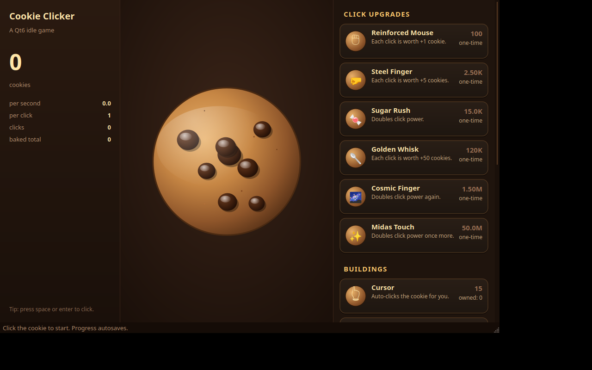

# Cookie Clicker (Qt6 / C++)

A small, polished cookie‑themed idle clicker built with **Qt 6** and **C++20**.
Click the giant chocolate‑chip cookie, watch it wobble, sparkle, and rain
crumbs, then spend your cookies on click upgrades and passive‑production
buildings. Achievements pop up as toasts, your progress autosaves, and the
whole UI is rendered with `QPainter` — no image assets required.



## Features

- **Animated cookie button**: idle "breathing" scale, hover lift, click pulse
  with overshoot, expanding gold shockwaves, and physically‑simulated crumb
  particles.
- **Floating "+N" feedback** that rises and fades on every click.
- **Click upgrades** (one‑shot): Reinforced Mouse, Steel Finger, Sugar Rush,
  Golden Whisk, Cosmic Finger, Midas Touch.
- **Buildings** (repeatable, classic 1.15× cost growth): Cursor, Grandma,
  Bakery, Factory, Cookie Mine, Shipment, Alchemy Lab, Portal, Time Machine.
- **Achievements** with animated toast notifications.
- **Autosave** to `QStandardPaths::AppDataLocation/save.json` every 15 s and on
  exit.
- **Custom QSS theme** — warm browns, gold accents, soft shadows.
- **Keyboard friendly** — Space / Enter clicks the cookie too.

## Building

You need **Qt 6.2+** (Widgets module) and a **C++20** compiler.

```bash
# Configure
cmake -S . -B build -DCMAKE_BUILD_TYPE=Release
# (or, if Qt is in a non-standard prefix:)
cmake -S . -B build -DCMAKE_PREFIX_PATH=/path/to/Qt/6.x/gcc_64

# Build
cmake --build build -j

# Run
./build/cookie_clicker
```

On Windows with the Qt online installer, point CMake at the kit, e.g.:

```bash
cmake -S . -B build -G "Ninja" -DCMAKE_PREFIX_PATH="C:/Qt/6.7.0/msvc2019_64"
cmake --build build
```

### Distro packages (Linux)

| Distro    | Packages                                                |
|-----------|---------------------------------------------------------|
| Debian/Ubuntu | `sudo apt install build-essential cmake qt6-base-dev` |
| Fedora        | `sudo dnf install gcc-c++ cmake qt6-qtbase-devel`     |
| Arch          | `sudo pacman -S base-devel cmake qt6-base`            |

## Project layout

```
CMakeLists.txt
src/
  main.cpp            Application entry point.
  Game.{h,cpp}        Pure game model: state, upgrades, save/load, achievements.
  Format.{h,cpp}      Compact number formatting (1.23K, 4.56M, …).
  CookieButton.{h,cpp}  Animated cookie widget (paint, particles, shockwaves).
  FloatingText.{h,cpp}  "+N" feedback widget.
  UpgradeCard.{h,cpp}   One row in the upgrade panel.
  UpgradePanel.{h,cpp}  Scrollable list of upgrade cards.
  Toast.{h,cpp}         Achievement toast notifications.
  MainWindow.{h,cpp}    Main layout, ticking, theming.
```

## Game design notes

- Buildings follow the classic Cookie Clicker pricing curve:
  `cost = floor(base_cost * 1.15 ^ owned)`.
- Click power is computed as `(1 + Σ flat_bonuses) * Π multipliers + cps * 0.01`
  so investing in production also gently boosts clicks.
- Idle production accrues at 10 Hz; UI animations run at ~60 Hz.

## License

MIT.
